# Design Review Results: La Perla Radio — Home Page

**Review Date**: 2026-02-25  
**Route**: `/` (Single Page Application)  
**Focus Areas**: Performance (bundle size, render performance, optimization)

---

## Summary

The app has a strong visual identity but faces significant performance bottlenecks. The page reaches **~20 MB** after scrolling due to uncompressed WAV audio assets and eagerly-loaded images. Core Web Vitals show critical failures: INP is **856ms** (poor, threshold <200ms) and CLS is **0.161** (needs improvement, threshold <0.1). Addressing audio format, lazy loading, and code splitting would yield the largest gains.

---

## Web Vitals Snapshot

| Metric | Measured | Threshold (Good) | Status |
|--------|----------|------------------|--------|
| FCP (First Contentful Paint) | 1144ms | < 1800ms | ✅ Pass |
| CLS (Cumulative Layout Shift) | 0.161 | < 0.1 | 🟠 Needs Improvement |
| INP (Interaction to Next Paint) | 856ms | < 200ms | 🔴 Poor |
| TTFB (Time to First Byte) | 8ms | < 800ms | ✅ Excellent |
| TBT (Total Blocking Time) | 585ms | < 200ms | 🔴 Poor |
| Page Size (after scroll) | ~20 MB | — | 🔴 Critically Heavy |

---

## Issues

| # | Issue | Criticality | Location |
|---|-------|-------------|----------|
| 1 | **WAV audio files used for 8+ tracks** — WAV is uncompressed and 5–10× larger than MP3/AAC. The 7 EP tracks + 4 recent singles (Casualidad, Francia, Tattoo, NFOK3, Xime) all use `.wav`. This is the primary driver of the 20 MB page weight. Convert to MP3 or AAC at 192kbps max. | 🔴 Critical | `data/playlist.ts:19,24,29,34,39,45,50,55,466,475,483,491` |
| 2 | **No `loading="lazy"` on any `` tag** — Every album cover, event image, and queue thumbnail loads immediately on page load regardless of whether it's in the viewport. All image tags across every component are missing `loading="lazy"`. | 🔴 Critical | `components/ReleasesSection.tsx:309`, `components/FavoritesSection.tsx:63`, `components/Player.tsx:294,321`, `components/NewsSection.tsx:48` |
| 3 | **INP 856ms — Heavy re-renders on interaction** — Toggling a favorite triggers a state update in `App` which re-renders the entire tree: `Header`, `Hero`, `ReleasesSection` (with a `useMemo` recalculation over 53 items), `FavoritesSection`, `Player`, `Footer`. Memoize leaf components with `React.memo` and extract favorites state into a context or memoized selector. | 🔴 Critical | `App.tsx:100-109`, `components/ReleasesSection.tsx:41-65`, `components/FavoritesSection.tsx:18` |
| 4 | **CLS 0.161 — FavoritesSection conditionally mounts/unmounts** — When the first favorite is added, `FavoritesSection` goes from `return null` to rendering a full section, pushing all content below it down. This is a major layout shift. Reserve space or use a CSS `height: 0` + `overflow: hidden` transition instead of returning `null`. | 🟠 High | `components/FavoritesSection.tsx:20` |
| 5 | **CLS — Album cover images in carousel have no explicit `width`/`height`** — Images inside `aspect-square` containers load without declared dimensions, causing reflow before aspect ratio is established. Add `width` and `height` attributes or use explicit `aspect-ratio` CSS. | 🟠 High | `components/ReleasesSection.tsx:308-312` |
| 6 | **No code splitting — Firebase + `@google/genai` in main bundle** — Both `firebase` (Firestore, Auth) and `@google/genai` are bundled synchronously at startup. Firebase alone adds ~200 KB gzipped and GenAI adds ~150 KB. Use dynamic `import()` for `CommentsSection` (which uses Firebase) and lazy-load `geminiService`. | 🟠 High | `firebase.ts`, `services/geminiService.ts`, `App.tsx:8` |
| 7 | **`@google/genai` is in `dependencies` but never imported in any rendered component** — The package is pulled into the bundle but only referenced in `services/geminiService.ts`, which itself doesn't appear to be imported anywhere in the app. If unused, remove it. If needed, dynamically import only when called. | 🟠 High | `package.json:13` |
| 8 | **Audio element instantiated outside `useEffect` (in render body)** — `new Audio()` is created during the render phase which has side effects and bypasses React's lifecycle. The audio instance won't be properly cleaned up on unmount. Move the initialization inside `useEffect` with a ref assignment. | 🟠 High | `components/Player.tsx:63-65` |
| 9 | **No `preload` attribute on audio — potential pre-buffering** — The `Audio` element defaults to `preload="auto"` in most browsers, meaning the browser may start downloading the current track's audio on page load. Explicitly set `audio.preload = "none"` until the user initiates playback. | 🟠 High | `components/Player.tsx:63-65` |
| 10 | **Hero background image is a large Imgur JPEG with no `<link rel="preload">`** — The LCP element is a CSS `background-image` on a `div`. CSS background images are not eligible for native browser preloading and can't be optimized via `fetchpriority`. Replace with an `` element (visually positioned the same) so it can receive `loading="eager"`, `fetchpriority="high"`, and be included in LCP calculation correctly. | 🟡 Medium | `components/Hero.tsx:23` |
| 11 | **Two concurrent `setInterval` timers for fake "online users"** — `CommentsSection` runs an interval every **5 seconds** and `Footer` runs one every **3 seconds**, both independently simulating fluctuating listener counts. This means two intervals are always running. Lift this logic to a shared context or `App.tsx` and pass the value down as a prop. | 🟡 Medium | `components/CommentsSection.tsx:77-79`, `components/Footer.tsx:21-29` |
| 12 | **`PLAYLIST_DATA.filter()` called on every render in `FavoritesSection`** — No memoization on line 18. Every time any parent state changes (e.g., `isPlaying`, `currentTrackIndex`), this filter over the entire 53-item playlist re-runs. Wrap in `useMemo`. | 🟡 Medium | `components/FavoritesSection.tsx:18` |
| 13 | **`localStorage.setItem` called on every favorites change with no debounce** — The `useEffect` that persists favorites fires synchronously on every add/remove. For a small array this is acceptable, but it blocks the main thread briefly on each interaction. Debounce by 300ms or use `requestIdleCallback`. | 🟡 Medium | `App.tsx:43-45` |
| 14 | **Imgur URLs for Hero background and APOYA logos** — Imgur does not serve WebP/AVIF or provide CDN edge caching like Cloudinary does. The rest of the app correctly uses Cloudinary. Migrate these assets to Cloudinary with format auto (`f_auto`) and quality auto (`q_auto`) transforms. | ⚪ Low | `components/Hero.tsx:23`, `App.tsx:277,283` |
| 15 | **Missing `favicon.ico` (404 error in browser console)** — Every page load generates a 404 for `/favicon.ico`. Add a favicon to the `public/` folder or add a `<link rel="icon">` in `index.html`. | ⚪ Low | `index.html` |
| 16 | **Copyright year hardcoded as `2024`** — The footer displays "© 2024" while the current year is 2026. Use `new Date().getFullYear()` to keep it always current. | ⚪ Low | `components/Footer.tsx:169` |

---

## Criticality Legend

- 🔴 **Critical**: Directly causes severe performance degradation or poor Core Web Vitals
- 🟠 **High**: Significantly impacts load time, bundle size, or render efficiency
- 🟡 **Medium**: Noticeable performance cost or code quality issue that should be addressed
- ⚪ **Low**: Minor optimization or polish item

---

## Recommended Priority Order

```mermaid
graph LR
    A["🔴 #1 Convert WAV → MP3/AAC<br/>(biggest page weight win)"]
    B["🔴 #2 Add loading='lazy' to all images<br/>(reduces initial payload)"]
    C["🔴 #3 React.memo + context for favorites<br/>(fixes INP 856ms)"]
    D["🟠 #4 Dynamic import Firebase + GenAI<br/>(code splitting)"]
    E["🟠 #5 Remove/lazy-load @google/genai<br/>(bundle size)"]
    F["🟠 #6 Fix FavoritesSection null→render CLS<br/>(fixes CLS 0.161)"]
    G["🟡 #7 Remaining medium/low items"]
    A --> B --> C --> D --> E --> F --> G
```

## Estimated Impact After Fixes

| Fix | Estimated Improvement |
|-----|-----------------------|
| Convert WAV → MP3 | Page weight: 20MB → ~4MB |
| Add lazy loading | FCP/LCP improvement, reduced bandwidth |
| React.memo + context | INP: 856ms → <200ms |
| Code splitting Firebase | Bundle size: ~350KB reduction |
| Remove unused @google/genai | Bundle size: ~150KB reduction |
| Fix FavoritesSection CLS | CLS: 0.161 → <0.1 |
